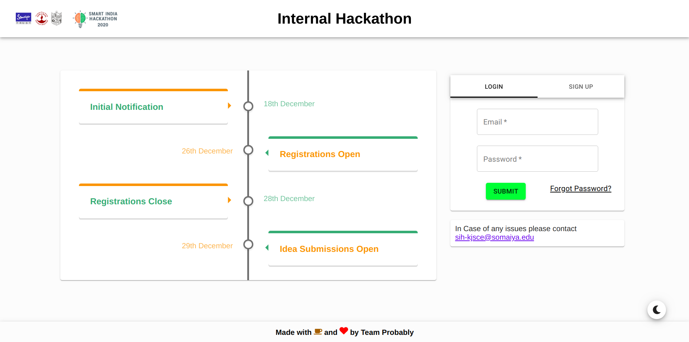
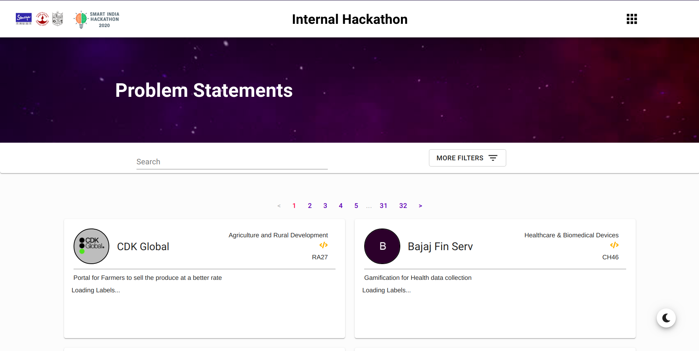
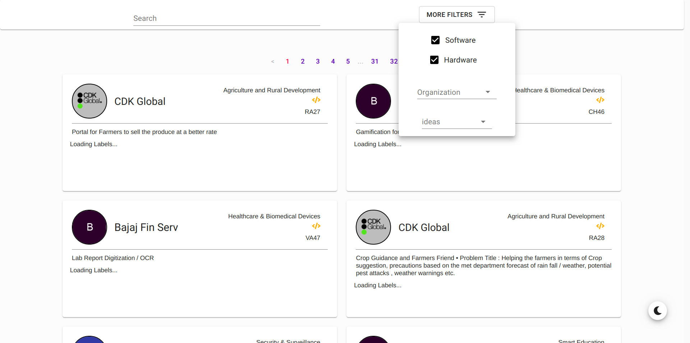
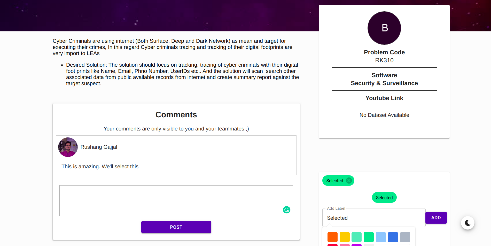
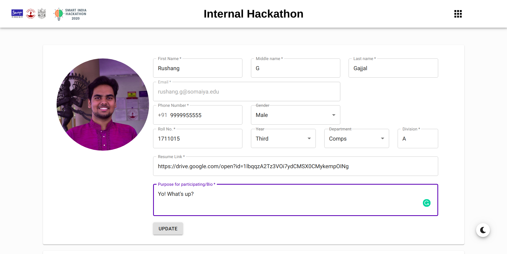
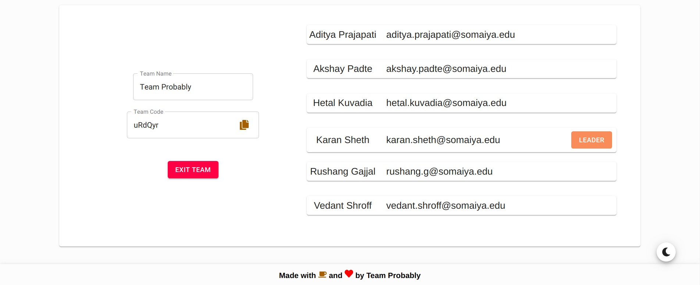
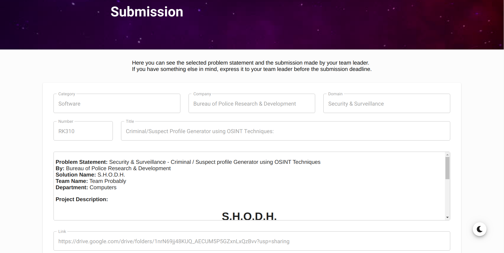

 

<h2 align="center"><b>SIH 2020 KJSCE Internal Hackathon Portal </b></h2>

 

-----------------------------------------------------------------------

## Description

* Smart India Hackathon 2020 brought a lot of changes in the idea submission and selection process, and the most prominent among those was to hold an Internal Hackathon for nominating teams. 
* We proposed a way that, to help our college in conducting this Internal Hackathon while making the selection procedure transparent and streamlined for all participating teams. 
* This included a tool to help them in shortlisting, grading and finally selecting the most suitable Problem Statement given their individual skillset, preference, and impact of the product.

-----------------------------------------------------------------------

### Features

* Displays the schedule of activities.
* Enables Team registration.
* One can browse through all the problem statements by SIH through applying various available filters.
* Collaboration and Discussion among all the Team Members of a Team via comments and labels.
* Submission of Ideas by Teams for the first review.
* Review of Submissions by the authorities.

## Final Product

https://sih.kjsce.com

-----------------------------------------------------------------------

## Screenshots

  

  

  

  

  

  

-----------------------------------------------------------------------

### Note

 This project was actually used by **[KJSCE](https://kjsce.somaiya.edu)** for accepting applications for SIH internal hack and for shortlisting teams and problem statements.

-----------------------------------------------------------------------

### Contributors

<!-- prettier-ignore-start -->
<!-- markdownlint-disable -->

<table align="center">
  <tr>
    <td align="center"><a href="https://github.com/akshay-99"> <b>Akshay Padte</b></a> </td>
    <td align="center"><a href="https://github.com/RusherRG"> <b>Rushang Gajjal</b></a> </td>
    <td align="center"><a href="https://github.com/Korusuke"> <b>Karan Sheth</b></a></td>
  </tr>
  <tr>
  <td align="center"><a href="https://github.com/Syn3rman"> <b>Aditya Prajapati</b></a></td>
  <td align="center"><a href="https://github.com/hetzz"> <b>Hetal Kuvadia</b></a> </td>
  <td align="center"><a href="https://github.com/vedant-shroff"> <b>Vedant Shroff</b></a></td>
  
  
  </tr>
</table>

<!-- markdownlint-enable -->
<!-- prettier-ignore-end -->

-----------------------------------------------------------------------

Made with ❤️ by <a href="https://github.com/Team-Probably">TeamProbably</a>

